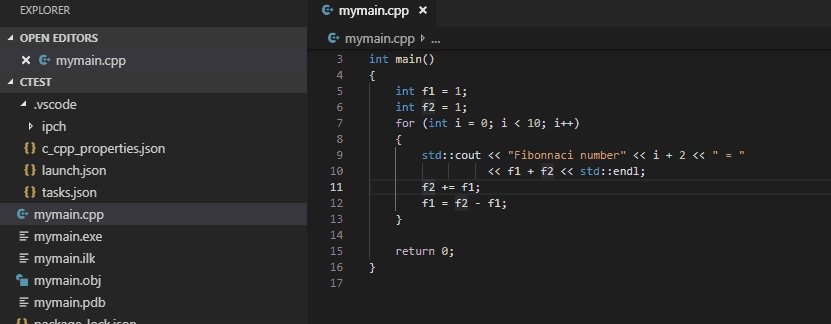

# Align Text for selected lines 

## VS Code extension "alignText"

### Features

The extension permits to align specific text token within selected lines

### Release Notes

Initial, but, functional version

#### 1.0.7

- Multi-cursor support added

#### 1.0.5

- Dependency packages update

#### 1.0.0

- Initial version

**Enjoy!**
